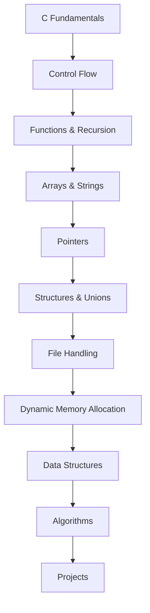

<h1 align="center">C Programming Journey</h1>

<p align="center">
  Learning C from the fundamentals up — one topic, one problem, one day at a time.
</p>

<p align="center">
  
  
  
  
  
</p>

<p align="center">
  <a href="#-progress-tracker">Progress</a> •
  <a href="#-learning-roadmap">Roadmap</a> •
  <a href="#-repository-structure">Structure</a> •
  <a href="#-projects">Projects</a> •
  <a href="#-about-me">About Me</a>
</p>

---

## 📖 About This Repository

This repository documents my journey learning **C programming from scratch**, as part of my B.Tech CSE (AI & Machine Learning) coursework. It's a **learning log, not a portfolio of mastery** — every folder here reflects what I'm actually practicing at that stage, warts and all.

The goal is simple: build a solid grasp of C fundamentals as a foundation for data structures, algorithms, and the systems-level thinking that underpins good software — including the AI/ML work I'm ultimately building toward.

> **Honesty note:** I'm an absolute beginner in C. This repo will grow slowly and visibly — that's the point.

---

## 🎯 Learning Objectives

- [ ] C fundamentals (syntax, data types, operators, I/O)
- [ ] Control flow (conditionals, loops)
- [ ] Functions and recursion
- [ ] Arrays and strings
- [ ] Pointers
- [ ] Structures and unions
- [ ] File handling
- [ ] Dynamic memory allocation
- [ ] Data structures (linked lists, stacks, queues, trees)
- [ ] Algorithms (searching, sorting, basic problem-solving)

---

## 🗺️ Learning Roadmap



---

## 📊 Progress Tracker

**Overall progress:**

```
▓░░░░░░░░░░░░░░░░░░░ 5%
```

### Topic Checklist

| Topic              | Status |
|---------------------|:------:|
| C Fundamentals       | ⬜ |
| Control Flow          | ⬜ |
| Functions              | ⬜ |
| Arrays & Strings        | ⬜ |
| Pointers                 | ⬜ |
| Structures & Unions       | ⬜ |
| File Handling               | ⬜ |
| Dynamic Memory                | ⬜ |
| Data Structures                  | ⬜ |
| Algorithms                         | ⬜ |

### Daily Log

<details>
<summary>Click to expand daily progress log</summary>

| Day | Date | What I Studied | Notes |
|-----|------|-----------------|-------|
| 01  |      |                 |       |
| 02  |      |                 |       |
| 03  |      |                 |       |

*(Updated as I go — see [`daily-log/`](./daily-log) for full entries.)*

</details>

---

## 📂 Repository Structure

```text
c-programming-journey/
│
├── 01-basics/
├── 02-control-flow/
├── 03-functions/
├── 04-arrays-and-strings/
├── 05-pointers/
├── 06-structures-and-unions/
├── 07-file-handling/
├── 08-dynamic-memory/
├── 09-data-structures/
├── 10-algorithms/
├── projects/
├── daily-log/
└── README.md
```

Each topic folder contains the C programs I write while learning that concept, along with short notes where useful. The `projects/` folder holds standalone programs that combine multiple concepts; `daily-log/` tracks day-by-day progress in more detail than the table above.

---

## 🚀 Projects

No projects yet — this section will fill in as I complete my first ones after covering the fundamentals. Planned first projects (subject to change):

- [ ] A simple CLI calculator
- [ ] A basic student record system using structures and file handling
- [ ] A small data structures demo (linked list / stack / queue)

---

## 🛠️ Tools & Development Environment

| Category      | Tool |
|----------------|------|
| OS               | Kali Linux (primary) and Windows (Lenovo LOQ) |
| Editor            | VS Code |
| Compiler           | GCC |
| Version Control     | Git & GitHub |

Compilation is done the standard way:

```bash
gcc filename.c -o output
./output
```

---

## 🧭 How I'm Approaching This

- Following my **college syllabus** rather than a specific external book or course for now.
- Practicing by writing programs myself first, then checking against reference material.
- Logging progress daily so growth is visible over time, not just claimed.
- Treating C as a foundation for **data structures, algorithms, and CS fundamentals** — skills I'll carry into the AI/ML and Python work I'm doing as part of my B.Tech (AI & ML) and IIT Madras BS in Data Science & Programming.

---

## 🎓 About Me

Hi, I'm **Ayush Singh** — a B.Tech CSE (AI & Machine Learning) student, also pursuing the IIT Madras BS in Data Science & Programming. I'm building toward a career in AI/ML, and this repository is where I'm putting in the reps on C as a core programming foundation, alongside my Python and data science work elsewhere.

**Connect:**
- GitHub: [@ayushsinghcode](https://github.com/ayushsinghcode)

---

## ⚠️ Disclaimer

This is a **learning repository**. Code here reflects my current skill level at the time it was written, not best practices in general. I'll refactor and improve older code as I learn more, but I won't rewrite history just to look more polished — the progression is the point.
